# Littlelyst (Ledgerbaz) Comprehensive Documentation

This document outlines the detailed workflows, role boundaries, and financial architecture of the platform.

## 1. Role Privileges & Boundaries (`super-admin` vs `admin`)

The platform strictly separates administrative capabilities to ensure financial and structural security.

| Action / Capability | `super-admin` | `admin` | `seller` | `buyer` |
| :--- | :---: | :---: | :---: | :---: |
| Access Admin Console (`/admin`) | ✅ | ✅ | ❌ | ❌ |
| View Platform Volume, Store Earnings & Fee Margins | ✅ | ✅ | ❌ | ❌ |
| Create `admin` Accounts | ✅ | ❌ | ❌ | ❌ |
| Promote / Demote User Roles (`seller` / `buyer` / `admin`) | ✅ | ❌ | ❌ | ❌ |
| Delete User Accounts | ✅ | ❌ | ❌ | ❌ |
| Assign or Promote to `super-admin` | ❌ (Strictly DB) | ❌ | ❌ | ❌ |
| Delete or Demote the `super-admin` Account | ❌ (Forbidden) | ❌ (Forbidden) | ❌ | ❌ |
| Public Self-Registration (`/register`) | ❌ (Rejected 400) | ❌ (Rejected 400) | ✅ | ✅ |
| Sell Products & Access Seller Dashboard (`/dashboard`) | ✅ | ❌ | ✅ | ❌ |
| Save Shipping / Contact Info for Auto-Fill at Checkout | N/A | N/A | ✅ | ✅ |

---

## 2. Buyer Experience & Checkout Auto-Fill

The buyer experience is designed to reduce friction during checkout while maintaining secure data handling.

- **Public Registration Role Selector**: Users can choose **"Merchant / Seller"** or **"Customer / Buyer"** during sign-up. 
- **Auto-Fill at Store Checkout**: When logged-in buyers visit any seller's storefront (e.g., `/[handle]` or `/[handle]/products/[slug]`), the checkout modal automatically detects their active session. It auto-fills their Name, Email, and Phone number, displays a **"Signed in as [Name]"** badge, and securely links their `buyerId` to the order record in the database.

---

## 3. Architectural Guide: Payment Flow & Ledger Bookkeeping

Here is how money moves, how balances are protected against race conditions, and how double-entry ledger integrity is maintained:

```mermaid
sequenceDiagram
    autonumber
    actor Buyer as Buyer
    participant Client as Next.js Storefront
    participant API as NestJS Backend
    participant PS as Paystack API
    participant DB as Postgres (ACID Transaction)
    participant WH as Paystack Webhook

    Buyer->>Client: Clicks "Pay with Paystack"
    Client->>API: POST /api/orders/checkout { items, buyerId, customerEmail }
    API->>DB: Check inventory & Insert Order (status: PENDING)
    API->>PS: Initialize Transaction (with unique reference)
    PS-->>API: authorization_url, access_code, reference
    API-->>Client: Returns authorization_url
    Client->>Buyer: Opens Paystack Gateway modal

    Buyer->>PS: Completes payment (Card / Transfer)
    PS->>WH: POST /api/payments/paystack-webhook (charge.success)
    
    rect rgb(20, 25, 40)
    Note over WH,DB: Double-Entry & Concurrency Protected Zone
    WH->>API: Validates HMAC-SHA512 Signature (`x-paystack-signature`)
    API->>DB: BEGIN TRANSACTION (SERIALIZABLE / READ COMMITTED)
    API->>DB: Check idempotency_keys (`paystack_tx_{reference}`)
    alt Already processed
        API-->>WH: 200 OK (Skip duplicate event)
    else First time processing
        API->>DB: SELECT * FROM wallets WHERE user_id = :seller_id FOR UPDATE
        API->>DB: Calculate Platform Fee (e.g. 5%) vs Seller Net (95%)
        API->>DB: UPDATE orders SET status = 'PAID'
        API->>DB: INSERT INTO ledger_entries (wallet_id, type='CREDIT', amount=seller_net)
        API->>DB: UPDATE wallets SET balance = balance + seller_net
        API->>DB: INSERT INTO idempotency_keys (`paystack_tx_{reference}`)
        API->>DB: COMMIT TRANSACTION
        API-->>WH: 200 OK
    end
    end
```

### Why These Mechanisms Protect Financial Data

1. **Double-Entry Ledger Integrity**:
   Account balances are never adjusted arbitrarily. Every financial movement generates an immutable row in the `ledger_entries` table recording:
   - `amount`: minor units (e.g., Kobo/Cents to prevent floating-point inaccuracies).
   - `type`: `CREDIT` or `DEBIT`.
   - `idempotencyKey`: referencing the unique gateway transaction (`paystack_tx_${reference}`).
   - `balanceAfter`: computed post-transaction balance.
   The platform fee margin (`totalVolumeMinor - sellerEarnedMinor`) is tracked per order, matching what the admin dashboard computes under **"Platform Earned"** and **"Store Payouts"**.

2. **Race Condition Prevention (`FOR UPDATE` Locking)**:
   When multiple webhooks or simultaneous purchases occur for the same store, concurrent transactions could overwrite the seller's wallet balance.
   Using PostgreSQL row-level locks (`SELECT ... FOR UPDATE`), only one transaction can touch and update the wallet row at any given millisecond. Competing transactions queue up safely and read the newly updated balance.

3. **Idempotency Keys**:
   Webhook providers like Paystack retry events up to 5 times if a server responds slowly or drops a packet.
   By indexing unique `idempotency_keys` (keyed by `paystack_tx_${reference}`), duplicate webhooks immediately exit without issuing double credits to the seller's wallet or incrementing order counts twice.
